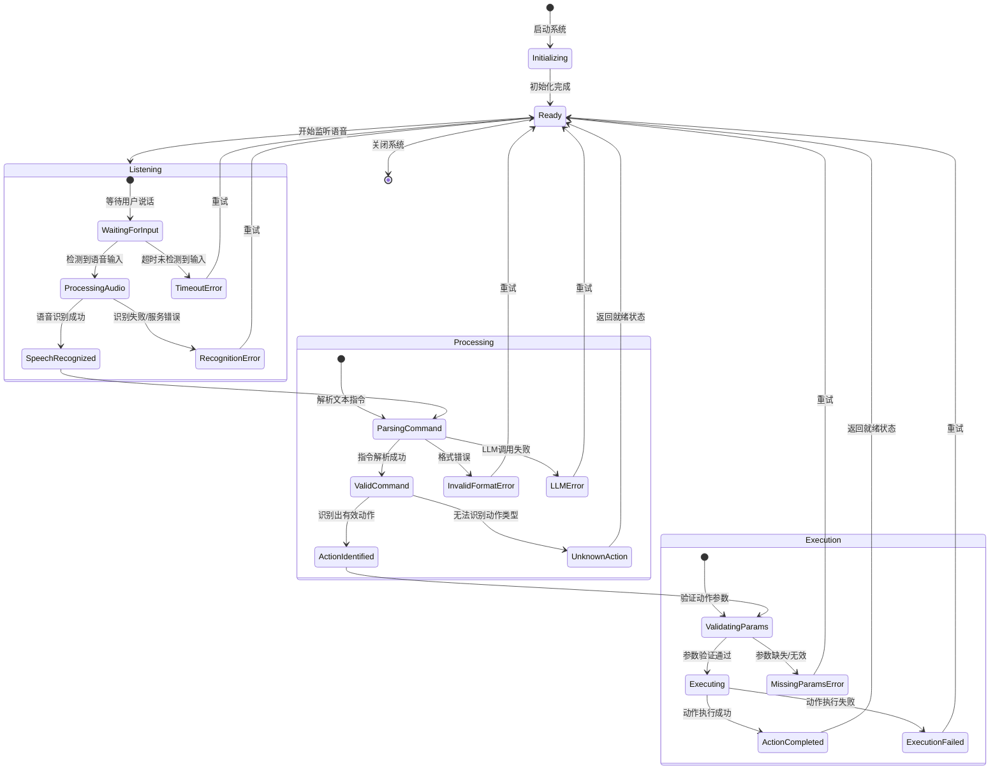

# LangChain

## 1 背景

近年来，ChatGPT、DeepSeek、Claude 等大语言模型（LLM）掀起技术热潮，在文案生成、图像绘制、代码编写、智能客服等领域广泛应用。随着模型调用成本降低，开发者尝试用 OpenAI、DeepSeek 等 API 搭建应用时，却面临诸多实操困境：

- 提示词（Prompt）散落在代码中，无法复用且长提示词难以维护；
- 不同大模型 API 格式差异大，项目切换模型需大幅修改代码，耦合度高；
- 实现多轮对话、工具调用、知识库整合等复杂功能时，逻辑混乱，后期维护成本高；
- 提示词设计、模型调用、工具集成等环节缺乏统一标准，团队协作易出现规范冲突。

LangChain 的出现恰好解决这些问题，它将模型调用、提示词管理、记忆模块、外部工具集成等功能模块化、标准化，支持模块 “搭积木” 式自由组合，大幅降低 LLM 应用开发门槛。

------


## 2 定义与技术体系

### 2.1 核心定义

LangChain 是基于 Python 的大语言模型应用开发开源框架，能帮助开发者快速搭建稳定的 LLM 应用项目架构，同时支持 JavaScript/TypeScript 版本（适用于前端和 Node.js 开发场景），其中 Python 版最为成熟，社区生态最完善。

### 2.2 技术体系核心模块

| 模块名称              | 核心功能                                                 | 关键说明                                                     |
| --------------------- | -------------------------------------------------------- | ------------------------------------------------------------ |
| `langchain-core`      | 封装基础聊天模型和核心组件                               | 整个框架的 “地基”，提供底层支撑                              |
| `integrations`        | 集成各大模型专属包                                       | 如 `langchain-openai`、`langchain-anthropic`，由 LangChain 团队与模型方共同维护，保证轻量兼容 |
| `langchain`           | 提供 “链（Chain）”、智能体（Agent）、检索器（Retriever） | 实现复杂功能的核心工具，是搭建应用的关键模块                 |
| `langchain-community` | 第三方集成包集合                                         | 由社区维护，覆盖更多小众工具和模型，扩展性极强               |
| `langgraph`           | 处理复杂任务流程                                         | 以 “图（Graph）” 规划任务路线，支持循环、分支逻辑，自动记录进度（如电商客服 “咨询 - 售后 - 跟进” 全流程） |
| `langsmith`           | LLM 应用全生命周期管理                                   | 覆盖开发、测试、部署、监控，展示应用每一步运行细节，支持所有 LLM 应用（不仅限于 LangChain 开发的应用） |

------


## 3 核心模块详解

### 3.1 LLM 接口：统一模型调用入口

LangChain 封装不同大模型的调用方式，提供统一接口，开发者可用几乎相同的代码调用 OpenAI、DeepSeek、Anthropic 等模型，切换模型无需大幅修改代码。

**代码示例（调用 DeepSeek 模型）**：

```python
from langchain_community.chat_models import ChatDeepSeek
# 创建大语言模型实例
llm = ChatDeepSeek(model="deepseek-chat")
```

### 3.2 PromptTemplate：提示词的 “智能模板”

LangChain 将提示词封装为 “模板”，支持动态变量替换，避免硬编码，提升提示词管理灵活性，直接影响大模型输出质量。

**代码示例（个性化欢迎语模板）**：

```python
from langchain_core.prompts import ChatPromptTemplate

# 定义系统消息和用户消息模板
system_prompt = ChatPromptTemplate.from_messages([
    ("system", "你是{platform}的智能助手，用户名为{name}")
])
user_prompt = ChatPromptTemplate.from_messages([
    ("human", "我想了解{topic}，能简单介绍下吗？")
])

# 组合模板并动态填充变量
combined_prompt = system_prompt + user_prompt
print(combined_prompt.invoke({
    "platform": "电商平台",
    "name": "张三",
    "topic": "退换货政策"
}))
```

### 3.3 Chain 链：模块串联的 “传送带”

Chain 是 LangChain 的核心思想，可将多个模块串联，使上一步输出自动作为下一步输入，类似工厂流水线，简化 “多步骤任务” 实现流程。

**代码示例（串联 “提示词模板→LLM 生成→结果解析”）**：

```python
from langchain_core.prompts import ChatPromptTemplate
from langchain_community.chat_models import ChatOpenAI
from langchain_core.output_parsers import StrOutputParser

# 定义提示词模板
prompt = ChatPromptTemplate.from_template("用3句话解释{concept}")
# 初始化LLM
llm = ChatOpenAI(model="gpt-3.5-turbo")
# 定义输出解析器（将LLM输出转为字符串）
parser = StrOutputParser()

# 用"|"串联模块，形成Chain
chain = prompt | llm | parser

# 调用Chain，得到结果
print(chain.invoke({"concept": "区块链"}))
```

### 3.4 RAG 检索：让 LLM “有依据” 回答

当 LLM 需要基于特定文档（如公司手册、产品说明书）回答问题，且文档内容不在模型训练数据中时，RAG（检索增强生成）可解决该问题，避免 LLM 产生 “幻觉”。

**RAG 核心流程**

1. **加载文档**：使用内置文档读取器（支持 TXT、PDF、Markdown 等格式）加载知识库；
2. **处理文档**：分割文档，通过嵌入模型（Embedding）将文本转为向量，存入向量数据库（如 Pinecone、Milvus）；
3. **检索生成**：用户提问时，先从向量数据库检索相关文档片段，再让 LLM 结合片段生成回答。

**代码示例（加载 PDF 产品说明书）**：

```python
from langchain_community.document_loaders import UnstructuredFileLoader

# 加载PDF格式的产品说明书
loader = UnstructuredFileLoader("./产品说明书.pdf")
# 读取文档内容
documents = loader.load()
# 后续可继续处理（分割、向量化、存入数据库）
```

### 3.5 Memory 记忆：让对话 “有上下文”

LLM 本身无记忆能力，多轮对话依赖历史对话记录的传递。LangChain 的 `Memory` 模块可自动保存历史对话，还能根据需求压缩记忆（避免 token 消耗过高）。

**代码示例（ConversationSummaryBufferMemory 自动总结历史对话）**：

```python
from langchain_core.prompts import ChatPromptTemplate, MessagesPlaceholder
from langchain_community.chat_models import ChatOpenAI
from langchain_core.output_parsers import StrOutputParser
from langchain.memory import ConversationSummaryBufferMemory

# 定义提示词模板（包含历史对话占位符）
prompt = ChatPromptTemplate.from_messages([
    ("system", "你是一个智能助手，用自然语言友好回复用户。"),
    MessagesPlaceholder(variable_name="history"),  # 历史对话占位符
    ("human", "{question}")
])

# 初始化记忆模块（设置最大token限制）
memory = ConversationSummaryBufferMemory(
    max_token_limit=500,  # 超过该限制时自动总结历史
    return_messages=True,
    llm=ChatOpenAI()  # 用于生成对话摘要的模型
)

# 初始化LLM和解析器
llm = ChatOpenAI()
parser = StrOutputParser()

# 构建Chain（先加载记忆，再串联其他模块）
chain = (
    {
        "question": lambda x: x["question"],
        "history": lambda x: memory.load_memory_variables({})["history"]
    }
    | prompt
    | llm
    | parser
)

# 模拟多轮对话
def chat(question):
    response = chain.invoke({"question": question})
    # 更新记忆（保存本轮对话）
    memory.save_context({"input": question}, {"output": response})
    return response

# 多轮对话示例
print(chat("我叫李四，是一名学生"))
print(chat("我刚才说我叫什么？"))  # 模型能记住姓名
print(chat("推荐一本适合我的编程书"))  # 结合“学生”身份推荐
```

### 3.6 Tool 工具调用：让 LLM “会干活”

LLM 擅长文本生成，但在实时计算、联网查询等任务上存在不足。LangChain 的 `Tool` 模块支持 LLM 调用外部工具（如计算器、搜索引擎、API 接口），扩展能力边界，整个过程由 Agent（智能体）主导。

#### Agent 核心作用

分析用户需求，判断是否需要调用工具、调用哪个工具，再根据工具返回结果继续处理（支持多轮调用）。

**代码示例（调用计算器解决数学问题）**：

```python
from langchain.agents import AgentType, initialize_agent, load_tools
from langchain_community.chat_models import ChatOpenAI

# 加载工具（这里加载“计算器”工具）
tools = load_tools(["calculator"])

# 初始化Agent
agent = initialize_agent(
    tools,
    ChatOpenAI(model="gpt-3.5-turbo"),
    agent=AgentType.CHAT_ZERO_SHOT_REACT_DESCRIPTION,
    verbose=True  # 显示思考过程
)

# 让Agent解决数学问题（会自动调用计算器）
agent.run("3的3次方加上15的平方根，结果是多少？")
```

------


## 4 应用开发逻辑

基于 LangChain 开发 LLM 应用的核心运行流程如下：

1. 用户提出问题；
2. 系统通过 `Memory` 模块读取历史对话（若为多轮对话）；
3. `PromptTemplate` 结合用户问题、历史对话（可选）生成动态提示词；
4. 若需基于特定知识库回答，通过 RAG 流程从向量数据库检索相似文档片段，融入提示词；
5. 将最终提示词传递给 LLM（通过统一 LLM 接口）；
6. 若需外部工具辅助（如计算、联网），由 Agent 调用对应 Tool 并获取结果，再反馈给 LLM；
7. LLM 生成回答后，经输出解析器处理，返回给用户，同时 `Memory` 模块保存本轮对话。

------

## 5 实践：用LangChain构建"语音→指令→动作"流水线，记录错误处理逻辑

对于一个 "语音→指令→动作" 流水线的状态转移图，应包含以下关键部分：

1. **主要流程状态**：
   - 初始化 (Initializing) → 就绪 (Ready) → 监听 (Listening) → 处理 (Processing) → 执行 (Execution)
2. **分支状态**：
   - 每个主要步骤都有成功和失败的分支
   - 错误状态都有明确的转换路径（通常是返回就绪状态重试）
3. **错误处理状态**：
   - 超时错误 (TimeoutError)
   - 识别错误 (RecognitionError)
   - 格式错误 (InvalidFormatError)
   - LLM 错误 (LLMError)
   - 参数缺失错误 (MissingParamsError)
   - 执行失败 (ExecutionFailed)



代码实现：

```python
import logging
import speech_recognition as sr
from langchain.llms import OpenAI
from langchain.chains import LLMChain
from langchain.prompts import PromptTemplate
from typing import Dict, Optional, Tuple, Any

# 配置日志记录
logging.basicConfig(
    level=logging.INFO,
    format='%(asctime)s - %(name)s - %(levelname)s - %(message)s',
    handlers=[
        logging.FileHandler("pipeline_errors.log"),
        logging.StreamHandler()
    ]
)
logger = logging.getLogger("voice_command_pipeline")

class VoiceCommandPipeline:
    def __init__(self, openai_api_key: str):
        """初始化语音指令流水线
        
        Args:
            openai_api_key: OpenAI API密钥
        """
        self.recognizer = sr.Recognizer()
        self.llm = OpenAI(api_key=openai_api_key, temperature=0)
        self._initialize_prompt()
        
    def _initialize_prompt(self):
        """初始化指令解析的提示模板"""
        prompt_template = """
        你是一个指令解析器，需要将用户的自然语言指令转换为可执行的动作指令。
        请分析以下用户指令，并返回一个包含"action"和"parameters"的JSON格式响应。
        "action"是具体要执行的动作名称，"parameters"是执行该动作所需的参数。
        
        可能的动作包括：
        - "open_application": 参数包括"app_name"
        - "send_message": 参数包括"recipient"和"content"
        - "set_reminder": 参数包括"time"和"message"
        - "search_internet": 参数包括"query"
        - "unknown": 当无法识别指令时使用
        
        用户指令: {command}
        """
        self.prompt = PromptTemplate(
            input_variables=["command"],
            template=prompt_template
        )
        self.chain = LLMChain(llm=self.llm, prompt=self.prompt)
    
    def _recognize_speech(self, source: sr.AudioSource) -> Tuple[Optional[str], Optional[str]]:
        """将语音转换为文本
        
        Args:
            source: 音频源
            
        Returns:
            识别到的文本和可能的错误信息
        """
        try:
            logger.info("开始语音识别...")
            audio = self.recognizer.listen(source, timeout=5, phrase_time_limit=10)
            text = self.recognizer.recognize_google(audio, language="zh-CN")
            logger.info(f"语音识别成功: {text}")
            return text, None
        except sr.WaitTimeoutError:
            error_msg = "语音识别超时，未检测到语音输入"
            logger.error(error_msg)
            return None, error_msg
        except sr.UnknownValueError:
            error_msg = "无法识别语音内容"
            logger.error(error_msg)
            return None, error_msg
        except sr.RequestError as e:
            error_msg = f"语音识别服务请求失败: {str(e)}"
            logger.error(error_msg)
            return None, error_msg
        except Exception as e:
            error_msg = f"语音识别发生未知错误: {str(e)}"
            logger.error(error_msg)
            return None, error_msg
    
    def _process_command(self, text: str) -> Tuple[Optional[Dict[str, Any]], Optional[str]]:
        """处理文本指令，转换为可执行动作
        
        Args:
            text: 语音识别得到的文本
            
        Returns:
            包含动作和参数的字典，以及可能的错误信息
        """
        try:
            logger.info(f"开始处理指令: {text}")
            result = self.chain.run(command=text)
            
            # 解析LLM返回的JSON
            import json
            action_data = json.loads(result)
            
            # 验证返回格式
            if not isinstance(action_data, dict) or "action" not in action_data:
                raise ValueError("指令解析结果格式不正确")
                
            logger.info(f"指令解析成功: {action_data}")
            return action_data, None
        except json.JSONDecodeError:
            error_msg = "无法解析LLM返回的结果为JSON"
            logger.error(f"{error_msg}: {result}")
            return None, error_msg
        except ValueError as e:
            error_msg = f"指令解析结果验证失败: {str(e)}"
            logger.error(error_msg)
            return None, error_msg
        except Exception as e:
            error_msg = f"指令处理发生未知错误: {str(e)}"
            logger.error(error_msg)
            return None, error_msg
    
    def _execute_action(self, action_data: Dict[str, Any]) -> Tuple[bool, Optional[str]]:
        """执行解析后的动作
        
        Args:
            action_data: 包含动作和参数的字典
            
        Returns:
            执行结果（成功/失败）和可能的错误信息
        """
        try:
            action = action_data["action"]
            parameters = action_data.get("parameters", {})
            
            logger.info(f"开始执行动作: {action}，参数: {parameters}")
            
            # 根据不同动作执行相应操作
            if action == "open_application":
                app_name = parameters.get("app_name")
                if not app_name:
                    raise ValueError("缺少应用名称参数")
                # 实际应用中这里会调用系统API打开应用
                logger.info(f"打开应用: {app_name}")
                
            elif action == "send_message":
                recipient = parameters.get("recipient")
                content = parameters.get("content")
                if not recipient or not content:
                    raise ValueError("缺少收件人或消息内容参数")
                # 实际应用中这里会调用消息API发送消息
                logger.info(f"向{recipient}发送消息: {content}")
                
            elif action == "set_reminder":
                time = parameters.get("time")
                message = parameters.get("message")
                if not time or not message:
                    raise ValueError("缺少时间或提醒内容参数")
                # 实际应用中这里会设置系统提醒
                logger.info(f"设置提醒 {time}: {message}")
                
            elif action == "search_internet":
                query = parameters.get("query")
                if not query:
                    raise ValueError("缺少搜索关键词参数")
                # 实际应用中这里会调用搜索引擎API
                logger.info(f"搜索网络: {query}")
                
            elif action == "unknown":
                logger.warning("无法识别的指令，不执行任何操作")
                return True, "无法识别的指令"
                
            else:
                raise ValueError(f"不支持的动作类型: {action}")
                
            logger.info(f"动作 {action} 执行成功")
            return True, None
            
        except ValueError as e:
            error_msg = f"动作执行参数错误: {str(e)}"
            logger.error(error_msg)
            return False, error_msg
        except Exception as e:
            error_msg = f"动作执行发生未知错误: {str(e)}"
            logger.error(error_msg)
            return False, error_msg
    
    def run_pipeline(self) -> Dict[str, Any]:
        """运行完整的语音→指令→动作流水线
        
        Returns:
            包含流水线各环节结果的字典
        """
        result = {
            "success": False,
            "step": None,
            "error": None,
            "details": {}
        }
        
        # 步骤1: 语音识别
        with sr.Microphone() as source:
            self.recognizer.adjust_for_ambient_noise(source)
            logger.info("请说话...")
            
            text, error = self._recognize_speech(source)
            if error:
                result["step"] = "speech_recognition"
                result["error"] = error
                return result
                
            result["details"]["recognized_text"] = text
        
        # 步骤2: 指令处理
        action_data, error = self._process_command(text)
        if error:
            result["step"] = "command_processing"
            result["error"] = error
            result["details"]["recognized_text"] = text
            return result
            
        result["details"]["action_data"] = action_data
        
        # 步骤3: 动作执行
        success, error = self._execute_action(action_data)
        if not success:
            result["step"] = "action_execution"
            result["error"] = error
            return result
        
        # 所有步骤成功完成
        result["success"] = True
        return result

# 使用示例
if __name__ == "__main__":
    import os
    from dotenv import load_dotenv
    
    # 加载环境变量（包含OpenAI API密钥）
    load_dotenv()
    openai_api_key = os.getenv("OPENAI_API_KEY")
    
    if not openai_api_key:
        logger.error("未找到OpenAI API密钥，请设置环境变量OPENAI_API_KEY")
    else:
        pipeline = VoiceCommandPipeline(openai_api_key)
        try:
            pipeline_result = pipeline.run_pipeline()
            if pipeline_result["success"]:
                print("流水线执行成功!")
                print("详情:", pipeline_result["details"])
            else:
                print(f"流水线在{result['step']}步骤失败: {result['error']}")
        except Exception as e:
            logger.critical(f"流水线整体执行失败: {str(e)}", exc_info=True)
```

------


# KAG+VLN/VLA

## 1 基础概念界定

### 1.1 KAG

#### 定义

KAG 是在传统 **知识图谱（KG，Knowledge Graph）** 基础上，通过融入**外部知识（常识、领域知识、多模态知识等）** 优化图谱结构与表示能力的增强型知识载体。其核心是解决传统 KG 存在的 “知识稀疏性”“模态单一性” 问题，使其更适配多模态任务（如视觉 - 语言任务）。

#### 核心目标

- 补充 “缺失知识”：例如在室内场景中，传统 KG 可能仅包含 “沙发”“桌子” 等实体，KAG 可额外融入 “沙发通常位于客厅，且材质多为布艺 / 皮质” 等常识。
- 跨模态关联：建立 “视觉特征（如物体外观）- 语言语义（如文本描述）- 结构化知识（如实体关系）” 的关联，为多模态任务提供先验知识。

#### 关键特征

| 特征维度   | 传统 KG                  | KAG（知识增强图谱）                    |
| ---------- | ------------------------ | -------------------------------------- |
| 知识来源   | 结构化文本（如维基百科） | 文本、图像、音频、领域数据库等多源数据 |
| 模态支持   | 仅文本 / 符号            | 支持多模态特征嵌入（如视觉实体向量）   |
| 知识粒度   | 粗粒度（实体 - 关系）    | 细粒度（实体属性、场景关系、常识规则） |
| 任务适配性 | 文本任务（如问答）       | 多模态任务（如 VLN、VLA、VQA）         |

### 1.2 VLN

#### 定义

VLN 是指**智能体（如机器人、虚拟角色）根据自然语言指令，在真实或虚拟的视觉环境中自主规划路径并到达目标位置**的技术，是 “视觉感知→语言理解→决策执行” 的端到端任务。

#### 核心目标

- 指令理解：准确解析自然语言中的 “目标位置”“路径约束”“场景特征”（如 “走到卧室里靠近窗户的书桌旁”）。
- 视觉定位：在动态 / 静态视觉环境中（如 3D 室内场景、真实街道）识别自身位置与周边物体。
- 路径规划：结合指令与视觉信息，生成无碰撞、高效的导航路径。

#### 典型应用场景

- 家庭服务机器人：根据 “把水杯从厨房拿到客厅茶几上” 的指令完成导航与操作。
- 虚拟现实（VR）：用户通过语音指令控制 VR 角色在虚拟场景中移动。
- 自动驾驶：根据 “前方 500 米右转进入超市停车场” 的自然语言指令辅助导航。

### 1.3 VLA

#### 定义

VLA 是建立**视觉模态（图像、视频）与语言模态（文本、语音）之间语义关联**的技术，核心是让模型理解 “视觉内容与语言描述的对应关系”，分为 “局部对齐” 与 “全局对齐” 两类。

#### 核心目标与分类

| 对齐类型 | 核心目标                                          | 示例                                    |
| -------- | ------------------------------------------------- | --------------------------------------- |
| 局部对齐 | 关联视觉中的 “实体 / 区域” 与语言中的 “词 / 短语” | 图像中 “红色轿车” 对应文本 “车是红色的” |
| 全局对齐 | 关联视觉中的 “整体场景” 与语言中的 “句子 / 段落”  | 图像（海滩日落）对应文本 “夕阳下的海滩” |

#### 关键价值

VLA 是所有视觉 - 语言任务的基础（如 VLN、VQA、图像 caption），其对齐精度直接决定后续任务的性能。

------


## 2 KAG 与 VLN/VLA 的融合逻辑

传统 VLN/VLA 依赖 “数据驱动”，存在**泛化差、缺乏常识、语义歧义**等问题；KAG 提供的 “结构化知识” 可针对性解决这些痛点，二者融合的核心逻辑如下：

### 2.1 传统 VLN/VLA 的核心痛点

1. **泛化能力弱**：仅能处理训练集中见过的场景 / 指令，遇到新物体（如 “扫地机器人”）或新场景（如 “实验室”）时性能骤降。
2. 缺乏常识推理：
   - VLN 中：无法理解 “冰箱在厨房”“钥匙通常在玄关抽屉” 等常识，导致导航路径混乱。
   - VLA 中：无法区分 “苹果（水果）” 与 “苹果（手机）”，仅靠视觉特征易误判。
3. **语义歧义处理差**：指令中 “那个高的”“旁边的” 等指代性表述，缺乏知识支撑时无法定位目标。

### 2.2 KAG 的补充价值

KAG 为 VLN/VLA 提供三类关键知识，形成 “数据 + 知识” 双驱动：

1. **实体属性知识**：如 “沙发→类型：家具，位置：客厅，颜色：多为灰色 / 米色”。
2. **场景关系知识**：如 “卧室→包含：床、床头柜、衣柜；床→位于：床头柜左侧”。
3. **常识规则知识**：如 “开门→需先找到门把手；热水→需从热水器 / 水壶获取”。

### 2.3 融合核心框架

KAG 与 VLN/VLA 的融合遵循 “知识注入→模态交互→决策增强” 三步流程，示意图如下：


------


## 3 核心技术细节

### 3.1 第一步：KAG 的构建与表示（融合基础）

要实现 KAG 与 VLN/VLA 的融合，需先构建适配多模态任务的 KAG，并将其转化为模型可理解的 “向量表示”。

#### 3.1.1 KAG 构建流程

1. **知识源选择**：
   - 通用常识库：ConceptNet（包含 “IsA”“PartOf” 等关系，如 “猫 IsA 动物”）、WordNet（语义网络）。
   - 领域知识库：室内场景库（如 Matterport3D Knowledge Graph，包含 3D 室内实体关系）、机器人操作库（如 Robot Knowledge Graph，包含物体操作规则）。
   - 多模态数据：从图像 / 视频中抽取视觉实体（如通过目标检测模型 Faster R-CNN 提取物体），与文本知识关联。
2. **知识抽取与融合**：
   - 实体抽取：从文本中抽取 “场景（客厅）、物体（沙发）”，从图像中抽取 “视觉实体（ bounding box + 特征向量）”。
   - 关系抽取：通过规则（如 “X 在 Y 里”→PartOf 关系）或模型（如 RE-BERT）抽取实体间关系。
   - 知识融合：解决多源知识的异构问题（如 “沙发” 与 “sofa” 的同义合并），常用方法有实体链接、属性对齐。
3. **知识验证与更新**：
   - 验证：通过人工审核或模型（如知识图谱补全模型 TransE）检测错误知识（如 “冰箱在卧室”）。
   - 更新：动态补充新场景 / 物体知识（如新增 “智能音箱” 实体及 “位于客厅，可语音控制” 属性）。

#### 3.1.2 KAG 表示学习（适配多模态模型）

传统 KG 表示（如 TransE、GAT）仅处理符号数据，需融合视觉特征生成 “多模态知识嵌入”：

1. 实体嵌入融合：
   - 对 KAG 中的实体（如 “沙发”），将其符号嵌入（GAT 输出）与视觉嵌入（从大量沙发图像中提取的 CLIP 特征）拼接，得到多模态实体向量。
2. 关系嵌入优化：
   - 对关系（如 “沙发 PartOf 客厅”），加入视觉场景特征（如客厅的全局图像嵌入），增强关系的场景关联性。
3. 常用模型：
   - Knowledge-Enhanced CLIP（KE-CLIP）：在 CLIP 基础上融入 KAG 实体嵌入，提升视觉 - 语言关联精度。
   - GraphSAGE-VL：基于 GraphSAGE 框架，将视觉特征作为节点属性，生成适配 VLN 的 KAG 嵌入。

### 3.2 第二步：KAG 在 VLN 中的应用技术

KAG 主要在 VLN 的 “指令理解→视觉感知→路径规划” 三阶段发挥作用，以下为具体技术方案：

#### 3.2.1 指令理解阶段：知识增强语义解析

- 核心问题：传统语义解析仅能拆分指令为 “动作（走）+ 目标（书桌）”，无法理解隐含知识（如 “书桌在卧室”）。
- 技术方案：
  1. 将指令输入预训练语言模型（如 BERT），得到初始语义向量。
  2. 结合 KAG 进行 “语义补全”：通过实体链接（如 “书桌”→KAG 中的 “书桌” 实体），获取其关联知识（“书桌→位置：卧室，关联物体：台灯”）。
  3. 生成 “知识增强语义向量”，作为后续导航的指导信号。
- 示例：指令 “找书桌”→KAG 补全 “书桌在卧室，需先到卧室”→语义解析结果更精准。

#### 3.2.2 视觉感知阶段：知识辅助场景理解

- 核心问题：视觉模型（如 ResNet）仅能识别物体类别，无法理解物体的场景意义（如 “看到床→知道这是卧室”）。
- 技术方案：
  1. 视觉传感器（如摄像头、3D 激光雷达）获取环境图像 / 点云，通过目标检测模型提取物体列表（如 “床、衣柜、台灯”）。
  2. 将物体列表与 KAG 匹配，通过 “场景分类器” 判断当前场景（如 “床 + 衣柜→卧室”）。
  3. 结合 KAG 知识过滤无效物体（如在 “找书桌” 任务中，KAG 提示 “床与书桌无关”，减少干扰）。

#### 3.2.3 路径规划阶段：知识指导决策

- 核心问题：传统路径规划（如 A* 算法）仅考虑 “距离最短”，忽略常识约束（如 “不能穿过墙壁”“厨房到客厅需经过走廊”）。
- 技术方案：
  1. 基于 KAG 构建 “场景拓扑图”：节点为场景（卧室、客厅），边为可行路径（卧室→走廊→客厅），边权重由 KAG 知识设定（如 “走廊路径安全，权重低”）。
  2. 采用 “知识增强强化学习（RL）”：
     - 状态：当前位置 + 视觉观测 + KAG 知识（如 “当前在厨房，目标书桌在卧室”）。
     - 动作：前进 / 左转 / 右转。
     - 奖励函数：除 “靠近目标” 的基础奖励外，加入 KAG 知识奖励（如 “走走廊路径 + 10 分，走墙壁方向 - 20 分”）。
- 典型模型：Knowledge-Enhanced VLN（KE-VLN），在 R2R 数据集上通过融入 ConceptNet 知识，将 Success Rate 提升 12%-15%。

### 3.3 第三步：KAG 在 VLA 中的应用技术

KAG 通过 “知识约束对齐逻辑” 提升 VLA 的精度与泛化性，分为局部对齐与全局对齐两类技术：

#### 3.3.1 局部对齐：知识消歧与实体匹配

- 核心问题：视觉实体与语言词的歧义（如 “苹果” 可能是水果或手机）、多义词匹配（如 “打” 在 “打羽毛球” 中对应 “运动”）。
- 技术方案：
  1. 视觉端：通过目标检测模型（如 Faster R-CNN）提取物体的 “视觉特征 + 类别标签”（如 “红色圆形物体，类别：苹果”）。
  2. 语言端：通过分词工具提取 “候选词 + 上下文”（如 “我吃了苹果，很甜”）。
  3. KAG 消歧：
     - 对视觉类别 “苹果”，在 KAG 中查询其 “父类别”（如 “水果”“电子产品”）。
     - 对语言词 “苹果”，结合上下文在 KAG 中匹配 “关联属性”（如 “甜”→关联 “水果”，“系统”→关联 “电子产品”）。
     - 确定唯一对齐关系（如 “视觉苹果→语言苹果（水果）”）。
- 典型模型：KAG-Augmented CLIP（K-Clip），在 Flickr30k 数据集上的局部对齐准确率提升 8%-10%。

#### 3.3.2 全局对齐：知识辅助场景匹配

- 核心问题：传统全局对齐仅依赖 “视觉特征与文本特征的余弦相似度”，无法理解场景的结构化关系（如 “海滩场景” 需包含 “沙子、海水、太阳”，缺一不可）。
- 技术方案：
  1. 视觉端：构建 “视觉场景图”（节点：物体，边：物体关系，如 “太阳在海水上方”）。
  2. 语言端：构建 “语言语义图”（节点：词，边：语义关系，如 “太阳照耀海水”）。
  3. KAG 约束匹配：
     - 从 KAG 中获取 “场景模板”（如 “海滩场景→必须包含：沙子、海水、天空；关系：沙子在海水旁边，太阳在天空中”）。
     - 以场景模板为约束，计算视觉场景图与语言语义图的 “结构相似度”（如匹配度≥0.8 则判定对齐）。
- 典型模型：Knowledge-Guided Scene Alignment（KGSA），在 COCO Captions 数据集上的全局对齐 R@1 指标提升 9%。

------


## 4 数据集与实验评估

### 4.1 核心数据集

学习 KAG+VLN/VLA 需掌握三类数据集：VLN 专用数据集、VLA 专用数据集、知识增强数据集。

| 数据集类型     | 数据集名称             | 任务场景                    | 核心特点                                         | 适用任务            |
| -------------- | ---------------------- | --------------------------- | ------------------------------------------------ | ------------------- |
| VLN 数据集     | Matterport3D Simulator | 3D 室内场景（住宅、办公室） | 包含 90 个场景、1000+ 导航路径、自然语言指令     | VLN 模型训练 / 测试 |
|                | Room-to-Room (R2R)     | 基于 Matterport3D           | 712 条指令、1403 条路径，指令含复杂约束          | VLN 基准测试        |
| VLA 数据集     | Flickr30k              | 图像 - 句子配对             | 30k 图像、150k 句子，涵盖日常场景                | VLA 局部 / 全局对齐 |
|                | COCO Captions          | 图像 - 多句子配对           | 120k 图像、500k 句子，物体类别丰富               | VLA 全局对齐        |
| 知识增强数据集 | ConceptNet-R2R         | 基于 R2R 扩展               | 融入 ConceptNet 常识，每个指令关联 5-10 条知识   | KAG+VLN 实验        |
|                | KAG-COCO               | 基于 COCO 扩展              | 每个图像关联 KAG 实体 / 关系（如 “猫→IsA→动物”） | KAG+VLA 实验        |

### 4.2 关键评估指标

评估 KAG+VLN/VLA 模型需从 “任务性能” 与 “知识有效性” 两方面衡量：

#### 4.2.1 VLN 任务评估指标

| 指标名称                           | 计算逻辑                            | 意义                 |
| ---------------------------------- | ----------------------------------- | -------------------- |
| Success Rate (SR)                  | 成功到达目标位置的 trials 占比（%） | 衡量导航成功率       |
| SR weighted by Path Length (SRwPL) | SR × (1 - 路径长度偏差)             | 兼顾成功率与路径效率 |
| Navigation Error (NE)              | 最终位置与目标位置的欧氏距离（米）  | 衡量导航精度         |

#### 4.2.2 VLA 任务评估指标

| 指标名称          | 计算逻辑                                  | 意义                              |
| ----------------- | ----------------------------------------- | --------------------------------- |
| Retrieval@k (R@k) | 给定文本，Top-k 图像中包含目标的比例（%） | 衡量局部 / 全局对齐精度           |
| BLEU-4            | 生成文本与参考文本的 n-gram 匹配度        | 衡量图像 caption 类任务的对齐质量 |
| CIDEr             | 生成文本与参考文本的语义相似度            | 比 BLEU 更关注语义一致性          |

#### 4.2.3 KAG 有效性评估指标

- **知识增益（Knowledge Gain）**：对比 “有无 KAG 融入” 的模型性能差异（如 SR 提升幅度、R@1 提升幅度），公式：
  `Knowledge Gain = (Model_with_KAG - Model_without_KAG) / Model_without_KAG × 100%`
- **知识覆盖率（Knowledge Coverage）**：模型在任务中成功调用 KAG 知识的比例（如指令解析中使用 KAG 补全知识的次数占比）